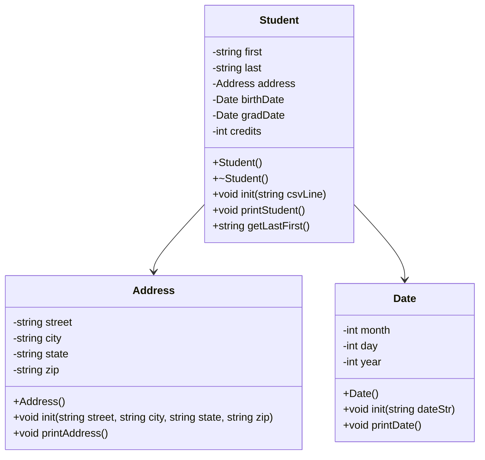

# Heap of Students - Part 1

**Name:** Steven Houser  
**Course:** CS 121 - Data Structures & Objects  
**Date:** 02/20/26

---

## UML Diagram

---

## Program Description

This program reads a comma-delimited CSV string of student data, parses it into Date, Address, and Student objects, and displays the data. The Student is created on the heap with `new` and cleaned up with `delete`.

---

## Algorithm

**Goal:** Parse a CSV string representing a student record into Date, Address, and Student objects, then display the data.

### Date class

**Date() constructor**
- Set month = 0, day = 0, year = 0 as safe defaults

**init(dateStr)**
- Load dateStr into a stringstream
- Use getline with '/' delimiter to extract sMonth, sDay, sYear as strings
- Use a converter stringstream to convert each string token to int
- Store results in month, day, year

**printDate()**
- Output month/day/year in MM/DD/YYYY format

---

### Address class

**Address() constructor**
- Set all string members to empty strings as safe defaults

**init(street, city, state, zip)**
- Assign each parameter directly to the matching member variable

**printAddress()**
- Output all fields on one line: street, city, state zip

---

### Student class

**Student() constructor**
- Set first = "", last = "", credits = 0 as safe defaults

**~Student() destructor**
- No internal heap data, destructor body is empty

**init(csvLine)**
- Load csvLine into a stringstream
- Use getline with ',' delimiter to extract tokens in order:
    - first, last, street, city, state, zip, birthStr, gradStr, sCredits
- Call address.init(street, city, state, zip) to set up the Address object
- Call birthDate.init(birthStr) and gradDate.init(gradStr) to set up the Date objects
- Use a converter stringstream to convert sCredits to int

**printStudent()**
- Print last, first on first line
- Call address.printAddress()
- Print "Born: " and call birthDate.printDate()
- Print "Grad: " and call gradDate.printDate()
- Print credits

**getLastFirst()**
- Return last + ", " + first as a formatted string

---

## Build Instructions

- **Build:** `make`
- **Run:** `make run`
- **Clean:** `make clean`
- **Debug:** `make debug`
- **Valgrind:** `make valgrind`
